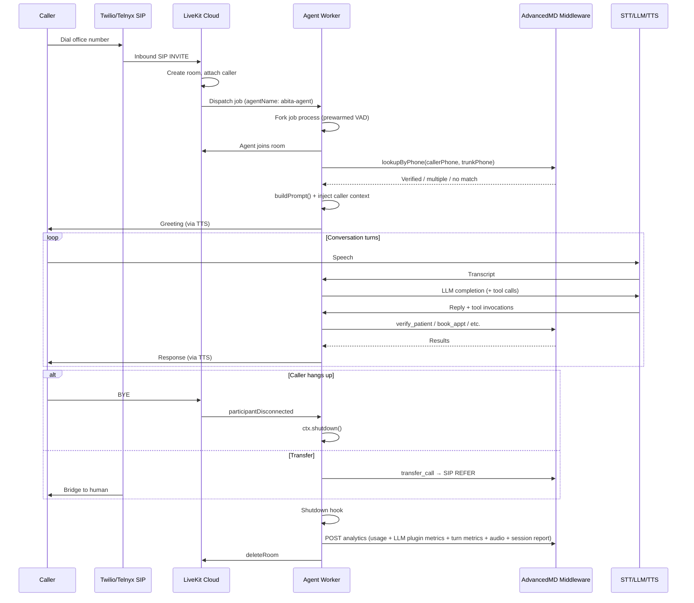

# LiveKit Voice Agent

A voice AI phone agent for Abita Eye Group / Eye Radiance. Patients call in over Twilio/Telnyx SIP trunks, the agent identifies them, handles scheduling/insurance/FAQ, and transfers to a human when needed.

## The stack

| Layer | Provider | Notes |
|---|---|---|
| Telephony | Twilio + Telnyx | Inbound SIP trunks → LiveKit Cloud SIP |
| Orchestration | `@livekit/agents` (Node) | Job dispatch, session mgmt, audio pipeline |
| STT | AssemblyAI | Streaming STT with adaptive keyterm/timing profiles |
| LLM | Baseten (GLM-4.7 primary, MiniMax-M2.5 fallback) | Via `FallbackAdapter` |
| TTS | LiveKit Inference Cartesia `cartesia/sonic-3-2026-01-12` | Voice defaults to `asher`; override with `CARTESIA_TTS_VOICE` |
| VAD | Silero (local ONNX) | Prewarmed per job process |
| Turn handling | LiveKit Agents | STT turn detection, adaptive interruptions, Silero VAD |
| Medical backend | AdvancedMD via Railway middleware | Patient lookup, booking, insurance |

## Call flow



## Repo layout

```
src/
├── main.ts          # Entry point: defineAgent, session setup, shutdown hooks, analytics POST
├── agent.ts         # Agent class: wires tools, loads instructions, speaks greeting on onEnter
├── prompt.ts        # Assembles system prompt from workspace/*.md + dynamic caller context
├── tools.ts         # LLM tools, CallState mutation, AdvancedMD middleware calls
├── model-config.ts  # Primary/fallback Baseten model configuration
├── stt-config.ts    # AssemblyAI keyterm and timing profiles
└── __tests__/       # Vitest unit tests

workspace/            # Prompt source files (edit these to change agent behavior)
├── SOUL.md          # Identity / persona (top of prompt)
├── VOICE.md         # Speech style guidelines
├── RUNBOOK.md       # Flow logic, tool usage, branching (bottom of prompt — highest attention)
├── KNOWLEDGE_*.md   # Location-specific FAQ (hours, directions, insurance)
└── INSURANCE_SPRING_HILL_CRYSTAL_RIVER.json # Shared deterministic insurance routing

livekit.toml         # LiveKit Cloud agent config (project + agent ID)
Dockerfile           # Multi-stage: pnpm install → build → download-files → prune → run
```

## How a call is handled

1. **SIP inbound** — caller dials a trunk number, LiveKit Cloud creates a room and fires a job request.
2. **Job dispatch** — the agent worker (`abita-agent`) accepts the job. A forked child process (prewarmed with Silero VAD) runs `entry()` in `main.ts`.
3. **Phone lookup** — before the session starts, `lookupByPhone(callerPhone, trunkPhone)` hits AdvancedMD. Three outcomes:
   - **Verified** — single patient match. Name, DOB, insurance, appointments injected into the prompt. Agent skips verification.
   - **Multiple matches** — multiple patients on this number. Agent asks for first name only (HIPAA-safe).
   - **No match** — treated as new patient flow.
4. **Session start** — `buildPrompt()` assembles the system prompt from `workspace/SOUL.md`, `VOICE.md`, `RUNBOOK.md`, then appends dynamic `<context>` (date/time + caller info). Tools are wired from `tools.ts`.
5. **Conversation loop** — AssemblyAI STT → Baseten LLM (with tool calling) → LiveKit Inference Cartesia TTS. The LLM calls tools like `verify_patient`, `get_availability`, `book_appt`, `check_insurance`, `lookup_knowledge`, etc. AdvancedMD-facing tools call the Railway middleware.
6. **Disconnect or transfer**:
   - Caller hangs up → `participantDisconnected` listener → `ctx.shutdown()`
   - Agent calls `transfer_call` → SIP REFER to human staff
7. **Shutdown hook** — captures LiveKit session usage, LLM plugin metrics, per-turn latency metrics, session report, and audio recording; POSTs everything to `ANALYTICS_URL` with exponential backoff retry; then deletes the room.

## Prompt assembly

The system prompt is stitched from markdown files in `workspace/` in a specific order. This matters for LLM attention (U-shaped curve — ends get more attention than middle):

```
<role>     ← SOUL.md      (identity, sets the frame)
<voice>    ← VOICE.md     (speech patterns)
<runbook>  ← RUNBOOK.md   (tool usage, flow logic — most critical per-turn)
<context>                 (appended dynamically — date/time + caller data)
```

**To change agent behavior, edit the workspace files.** The code doesn't need to change for prompt tweaks.

## Tools

| Tool | Purpose |
|---|---|
| `verify_patient` | Look up patient by first name + last name + DOB (or phone) |
| `add_patient` | Register a new patient |
| `update_insurance` | Update insurance on file |
| `get_availability` | Find open appointment slots |
| `confirm_appt` / `cancel_appt` / `book_appt` | Appointment management |
| `check_insurance` | Eligibility check |
| `lookup_knowledge` | Search location-specific FAQ (`KNOWLEDGE_*.md`) |
| `route_to_spring_hill` | Switch Crystal River scheduling calls to Spring Hill AMD routing |
| `transfer_call` | SIP REFER to human |

All tools read/write `session.userData` (typed `CallState` in `tools.ts`), which holds the call's pre-loaded context and any data collected during the conversation.

Side-effecting tools disable caller interruptions at the mutation boundary with `makeCurrentSpeechUninterruptible()` before they call the middleware:

| Non-interruptible tool | Why |
|---|---|
| `add_patient` | Creates a patient record |
| `update_insurance` | Changes insurance on file |
| `cancel_appt` | Cancels an appointment |
| `book_appt` | Books an appointment |
| `transfer_call` | Initiates SIP transfer |

Read-only/context tools remain interruptible so callers can naturally barge in during lookup or FAQ flow.

## Local development

```bash
pnpm install
cp .env.example .env.local   # fill in LIVEKIT_*, ASSEMBLYAI_*, ELEVENLABS_*, BASETEN_*, AMD_*
pnpm dev                     # runs src/main.ts via tsx with live reload
```

Test against a SIP trunk requires a real Twilio/Telnyx setup — see `TELNYX_SETUP.md`.

## Deploy

Push to `main` to deploy with GitHub Actions:

```bash
git push origin main
```

Check status:

```bash
lk agent status
gh run list --workflow="Deploy to LiveKit Cloud" --limit 5
```

## Key environment variables

| Var | Purpose |
|---|---|
| `LIVEKIT_URL` / `LIVEKIT_API_KEY` / `LIVEKIT_API_SECRET` | LiveKit Cloud credentials |
| `ASSEMBLYAI_API_KEY` | STT |
| `CARTESIA_TTS_VOICE` | Optional TTS voice override; defaults to `asher` |
| `BASETEN_API_KEY` | LLM (GLM-4.7 + MiniMax fallback) |
| `AMD_API_URL` / `AMD_API_TOKEN` | AdvancedMD middleware |
| `ANALYTICS_URL` / `WEBHOOK_SECRET` | Post-call analytics endpoint |
| `PROMPT_WORKSPACE` | Optional alternate prompt workspace path |

## Secrets management

**Never run `lk agent update-secrets` without `--overwrite` considered carefully.** That command *replaces* the entire secret set. To update a single secret, fetch the current list with `lk agent secrets`, edit locally, then push the full set back.

## Known issues & history

- **2026-04-09** — `@livekit/agents@1.2.3` ProcPool concurrency bug caused missed inbound calls when two rang simultaneously. Fixed by bump to 1.2.4. See [`INCIDENT-2026-04-09-concurrent-dispatch.md`](./INCIDENT-2026-04-09-concurrent-dispatch.md).

## Further reading

- [`CLAUDE.md`](./CLAUDE.md) — guidance for AI coding assistants working in this repo
- [`ROADMAP.md`](./ROADMAP.md) — planned improvements
- [`PROMPT-IMPROVEMENTS.md`](./PROMPT-IMPROVEMENTS.md) — prompt change log
- [`ASSEMBLYAI.md`](./ASSEMBLYAI.md) — AssemblyAI STT design notes
- [`TELNYX_SETUP.md`](./TELNYX_SETUP.md) — SIP trunk provisioning
- [`CONTEXT-MANAGEMENT.md`](./CONTEXT-MANAGEMENT.md) — how `session.userData` flows through tools
- [`workspace/RUNBOOK.md`](./workspace/RUNBOOK.md) — the operational heart of the agent
