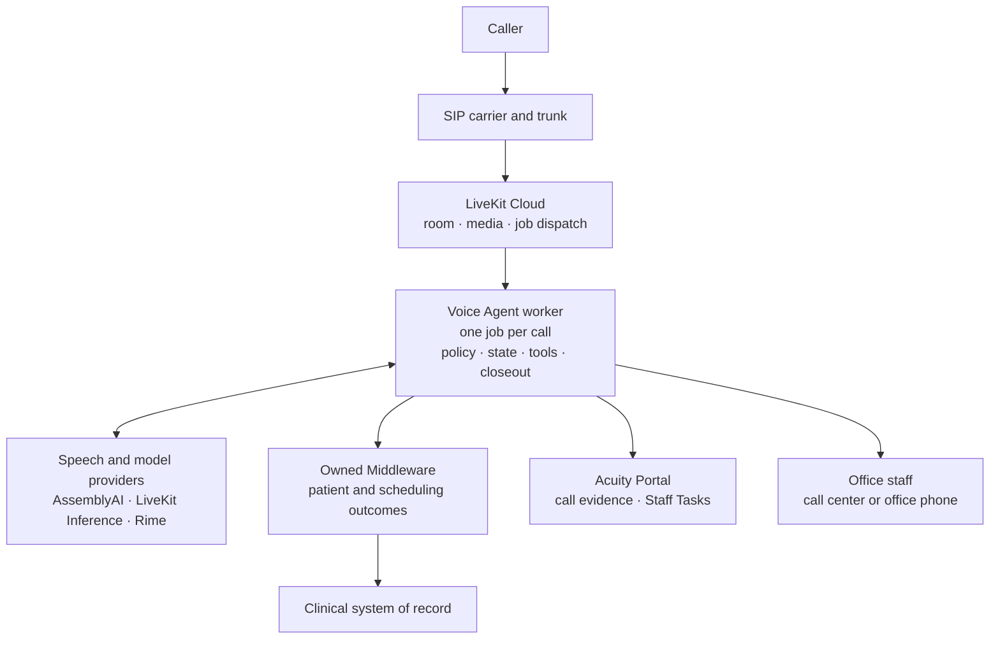
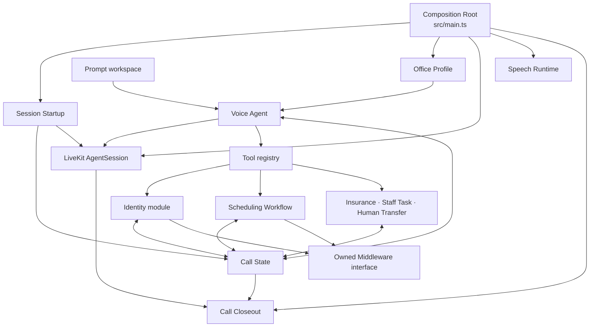
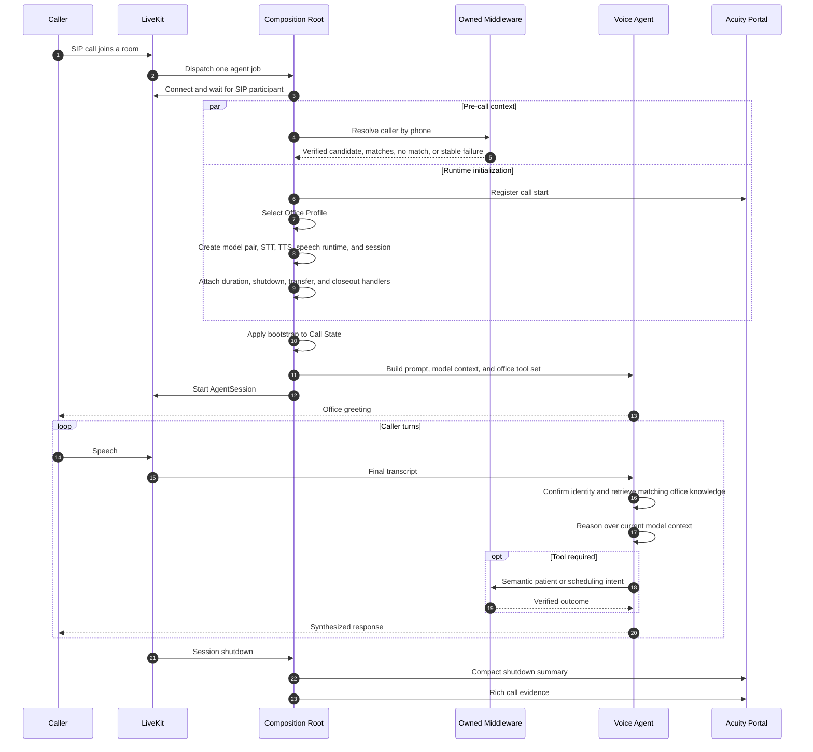
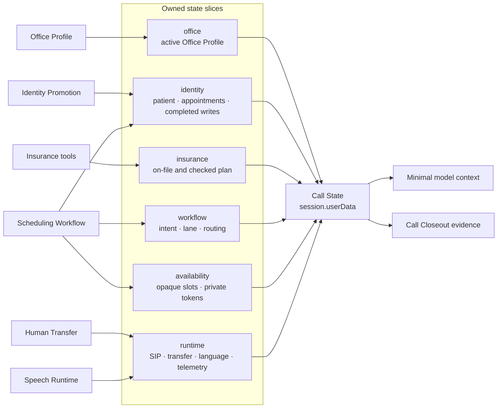
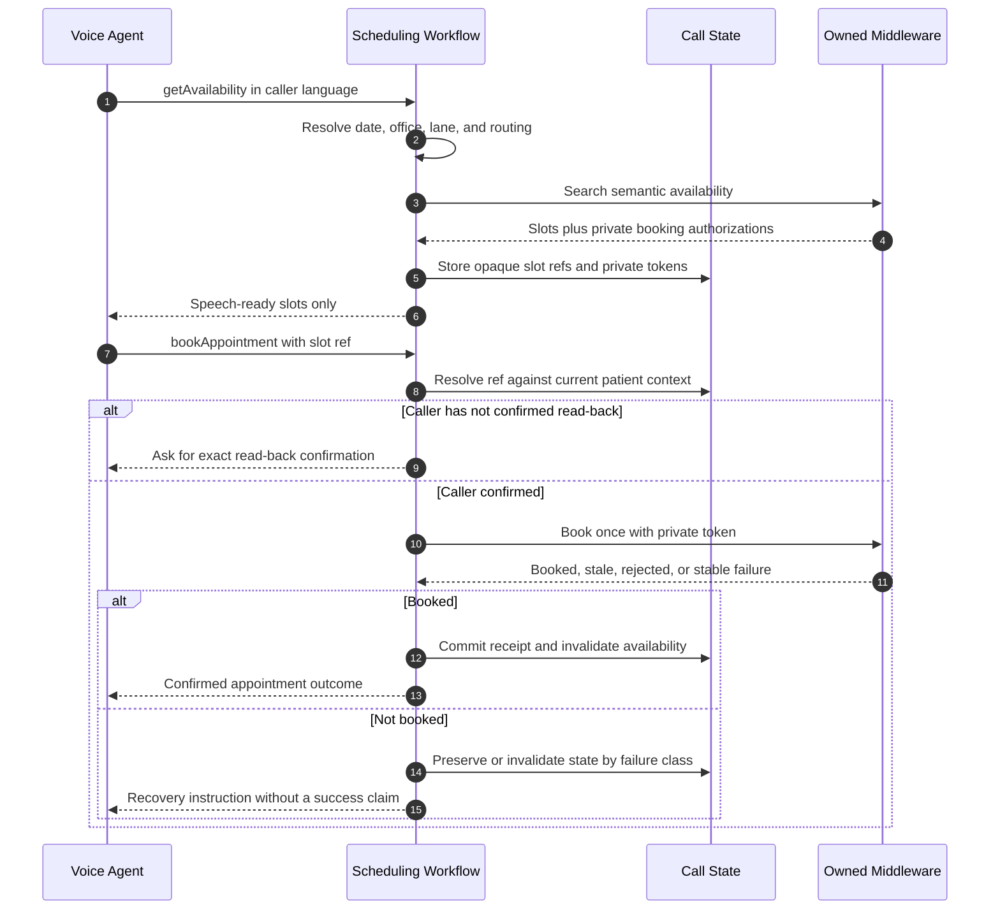
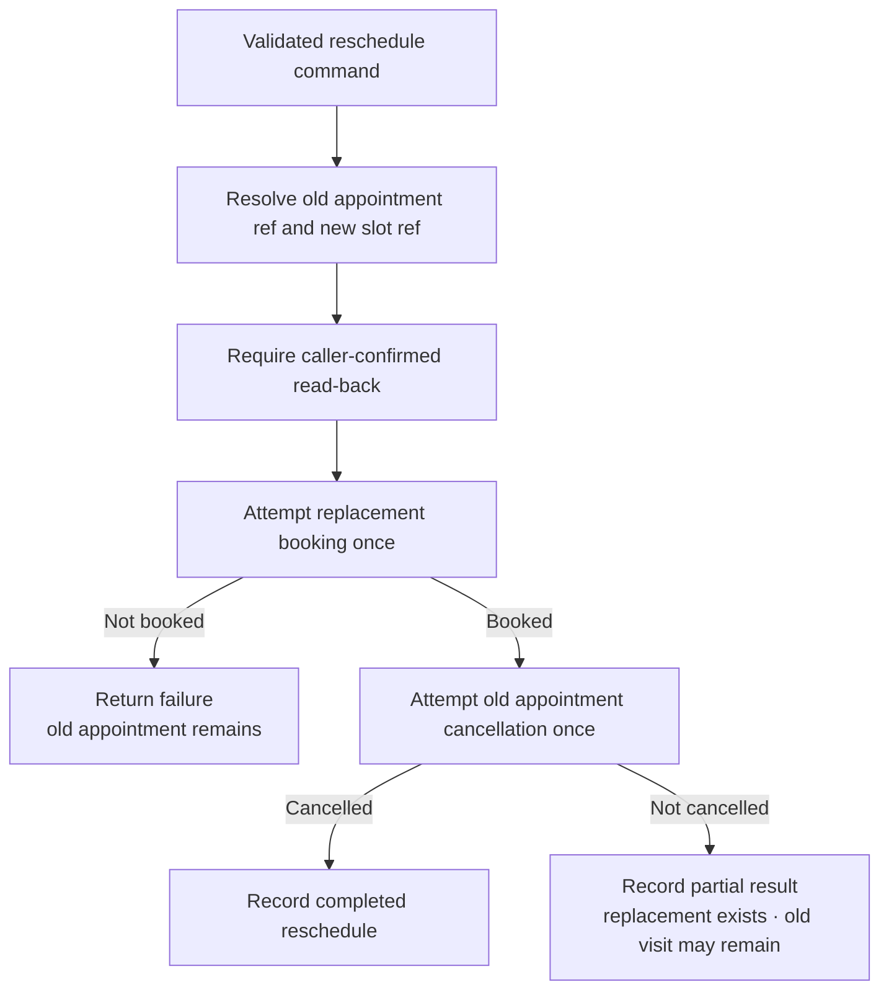
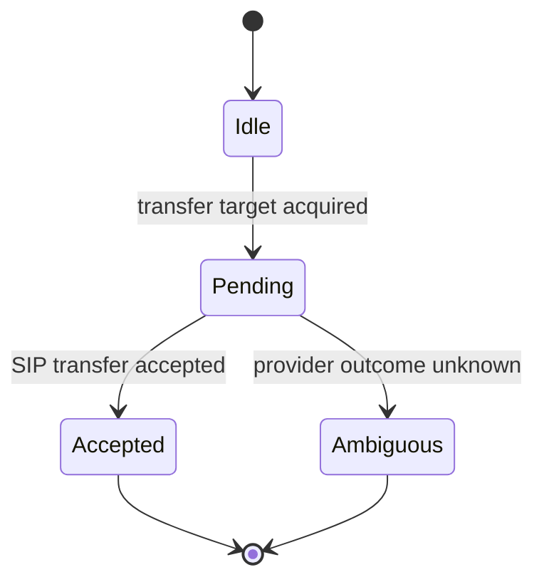
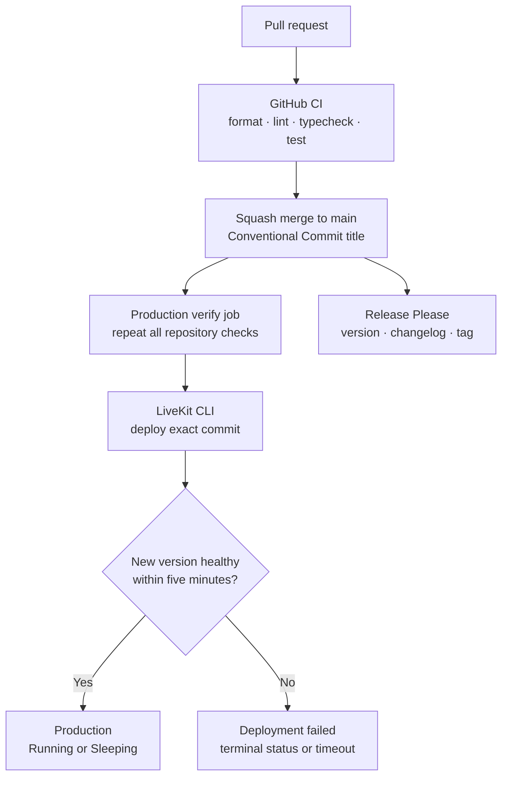

# Abita Voice Agent

**A production voice front desk for Abita Eye Group, Eye Radiance, and supported
practice lines.**

The Voice Agent owns one caller conversation from SIP ingress through
completion, staff follow-up, or Human Transfer. It identifies callers, answers
office questions, handles patient and insurance workflows, searches and changes
appointments, captures Staff Tasks, and delivers call evidence to the Acuity
portal.

The runtime is a TypeScript [LiveKit Agents](https://docs.livekit.io/agents/)
worker. It keeps conversation policy and Call State inside the worker while
delegating patient and scheduling effects to owned middleware.

Runtime code and interface-level tests are the source of truth. Product work is
tracked in [GitHub Issues](https://github.com/chasef07/abita_agent/issues).

## Architecture in one minute

Read the main path from top to bottom. LiveKit owns the real-time room and media
transport. One worker job owns one call. The worker never talks directly to the
clinical system of record.



The architectural rule is:

```text
caller intent → office policy + Call State → executed tool → verified effect
```

The model may choose an allowed tool. It does not own backend policy, private
identifiers, booking authorizations, write success, transfer success, or final
call evidence.

## Design from first principles

Six principles shape the implementation:

1. **One call has one state owner.** `session.userData` is the authoritative
   typed Call State for the lifetime of the job.
2. **The inbound trunk selects policy.** The Office Profile owns identity,
   prompts, supported care, speech, middleware routing, Staff Task
   availability, and Human Transfer behavior.
3. **Interfaces hide private mechanics.** The model sees opaque appointment and
   slot references plus speech-ready outcomes. Backend IDs, booking tokens,
   cancellation tokens, transport payloads, and provider errors remain inside
   their owning modules.
4. **Side effects require executed proof.** A booking, cancellation, patient
   change, Staff Task, or Human Transfer is successful only after its tool
   implementation reports success.
5. **Identity transitions invalidate old work.** Promoting or switching the
   active patient clears scheduling and insurance state that belonged to the
   prior patient.
6. **Closeout observes; it does not invent.** Final status and analytics are
   derived from session events, tool executions, and Call State.

## The modules

Each module exposes a small interface and hides a deeper implementation. This
gives callers leverage and keeps changes local.

| Module | Interface callers learn | What the implementation owns |
| --- | --- | --- |
| Composition Root | One LiveKit job entry | Provider construction, dependency wiring, startup order, session options, and shutdown registration |
| Session Startup | `coordinateSessionStartup` | Concurrent pre-call lookup and runtime initialization, startup cancellation, telemetry, and ordered session start |
| Voice Agent | `createVoiceAgent` | Prompt assembly, greeting, turn hooks, patient model context, Office Knowledge Hook, and tool registration |
| Office Profile | Lookup by trunk or office key | Office identity, care policy, prompts, speech, middleware routing, Staff Task capability, and Human Transfer policy |
| Identity | Resolve, confirm, create, promote, or switch patient | Candidate hydration, identity transitions, active-patient replacement, and invalidation of prior-patient work |
| Scheduling Workflow | `getAvailability`, `bookAppointment`, `cancelAppointment`, `rescheduleAppointment` | Date interpretation, office and lane policy, availability coordination, opaque references, private tokens, read-back gates, replay protection, write ordering, state transitions, and speech-ready outcomes |
| Owned Middleware | `resolvePatient`, `createPatient`, `updateInsurance`, `getAvailability`, `bookAppointment`, `cancelAppointment` | Authenticated HTTP transport, office routing, timeouts, response validation, and semantic result normalization |
| Call State | `CallState` plus narrow state helpers | Office, identity, insurance, workflow, availability, runtime, transfer, and observation facts for one call |
| Speech Runtime | STT, turn-profile, language, and TTS controls | Adaptive endpointing, prompt-sensitive recognition profiles, English/Spanish switching, and speech telemetry |
| Human Transfer | `transfer_call` | Handoff policy, direct handoff acquisition, SIP transfer, idempotent state transitions, and ambiguous-outcome handling |
| Staff Task | `create_staff_task` | Safe task payloads, deterministic idempotency keys, portal delivery, and per-call receipts |
| Call Closeout | `CallPortal` and a session event adapter | Call-start registration, session evidence capture, private-selector redaction, bounded delivery, duration enforcement, and terminal status |

`src/main.ts` is the composition root. Workflow modules do not create their own
production dependencies.

## Module flow inside one job



The tool registry is policy-aware: every office receives the core identity,
insurance, scheduling, transfer, and end-call tools; Staff Task capture is
included only when the selected Office Profile supports it.

## A call through the system

Pre-call patient lookup overlaps provider and session initialization to reduce
time to greeting. State is not exposed to turn handlers until bootstrap has
been applied.



A failed pre-call lookup becomes typed `lookup_failed` state; it does not
pretend the caller was absent. The call can continue and resolve identity
through the normal tool interface.

## Call State

Call State is the one runtime authority within a live job. Each module owns a
narrow slice and callers use helpers instead of reconstructing state rules.



Important state invariants:

- A patient is writable only after identity confirmation or successful patient
  creation.
- Identity promotion increments transition state and resets patient-owned
  scheduling work.
- Availability belongs to the active patient, office, lane, routing, and
  request generation that produced it.
- The model receives opaque `appointmentRef` and `appointmentSlotRef` values,
  never backend IDs or private authorization tokens.
- Concurrent duplicate booking, cancellation, and rescheduling tool calls are
  rejected.
- Completed appointment writes are retained per patient so retries can return
  the committed outcome without repeating the mutation.

## The scheduling handshake

Availability and appointment mutations are one deep Scheduling Workflow. A
search result is not a booking, and a model statement is never proof of a
write.



Rescheduling preserves the existing appointment until the replacement is
known to exist:



The middleware owns provider-side revalidation and reconciliation. The Voice
Agent owns conversational ordering, private-token handling, replay protection,
and truthful speech.

## Interfaces and adapters

The important seams have both production and deterministic adapters. Tests
cross the same interfaces used by production callers.

| Seam | Dependency category | Interface | Production adapter | Test adapter |
| --- | --- | --- | --- | --- |
| Patient and scheduling outcomes | Remote but owned | `OwnedMiddleware` | `HttpOwnedMiddleware` | `InMemoryOwnedMiddleware` |
| Scheduling transport | Remote but owned | `SchedulingMiddleware` | `productionSchedulingMiddleware` | `InMemorySchedulingMiddleware` |
| Portal delivery | Remote but owned | `CallPortal` | `HttpCallPortal` | `InMemoryCallPortal` |

LiveKit, AssemblyAI, Rime, and the model providers are true-external
dependencies. Their mechanics stay in the composition root, speech runtime,
and Human Transfer implementation rather than leaking through Call State or
tool results.

## Human Transfer

Human Transfer has a one-way state machine. If the SIP provider call fails
after transfer begins, the result is ambiguous and the tool does not
automatically repeat the request.



Call-center profiles first request a short-lived direct handoff target from the
Acuity handoff interface, then ask LiveKit to transfer the SIP participant.
Phone-mode profiles transfer to their configured office target. The original
inbound trunk remains the owner of the handoff destination even if scheduling
temporarily selected another office.

## Failure and recovery

| Failure | Owner | Runtime response |
| --- | --- | --- |
| Unsupported trunk | Office Profile / bootstrap | Record a non-retryable lookup failure; fail startup when office policy cannot be selected |
| Pre-call lookup timeout or backend failure | Pre-call bootstrap | Preserve `lookup_failed`; continue without claiming no patient exists |
| Invalid middleware response | Owned Middleware adapter | Return `invalid_response`; do not mutate state from malformed data |
| Middleware network failure | Owned Middleware adapter | Return a stable failure; expose no provider payload or raw error to the model |
| Patient changes while a write is in flight | Identity and Scheduling | Attribute the result to the original patient; do not merge it into the newly active patient |
| Expired or rejected booking authorization | Scheduling Workflow | Invalidate affected availability and require a fresh search |
| Invalid cancellation authorization | Scheduling Workflow | Clear loaded appointment authority and require patient and appointment reload |
| Replacement booked but old appointment not cancelled | Scheduling Workflow | Record a partial reschedule and route the remaining cancellation to staff |
| Duplicate appointment mutation | Tool interface / Scheduling Workflow | Reject concurrent duplicates or replay the completed per-patient outcome |
| Staff Task replay | Staff Task module | Return the recorded receipt for the deterministic idempotency key |
| SIP transfer outcome unknown | Human Transfer | Enter `ambiguous`; do not retry automatically |
| Call exceeds duration limit | Call Closeout | Set `duration_limit`, stop the session, and close out available evidence |
| Portal delivery failure | Call Closeout | Retry with bounded attempts; never block forever |
| Startup fails after call registration | Call Closeout | Deliver a failed-startup summary and rich terminal record |

## Observability and privacy

Closeout sends three ordered portal phases:

1. `call-start` registers the live call.
2. `shutdown-summary` sends a compact terminal record and retries at most twice.
3. `shutdown` sends richer evidence and retries at most four times.

Evidence can include timing, usage, model summaries, session event classes,
language transitions, tool outcome classes, identity transitions, appointment
actions, availability reads, middleware failure classes, selected Call State,
the LiveKit session report, and bounded recorded audio.

The Call State sanitizer removes private backend selectors such as patient IDs,
appointment IDs, booking tokens, cancellation tokens, insurance plan IDs, and
responsible-party IDs from the rich state snapshot. This is not a
de-identification guarantee: caller phone, conversation history, and optional
audio are operational call records. Production portal access, retention, and
downstream use must remain restricted accordingly.

Never add secrets, raw provider responses, private authorization values, or raw
transcripts to public issues, pull requests, or logs.

## Tool surface

| Intent | Model-facing tools | Success authority |
| --- | --- | --- |
| Patient identity | `resolve_patient`, `add_patient` | Verified or created patient result plus Identity Promotion |
| Insurance | `check_insurance`, `update_insurance` | Office policy or successful middleware update |
| Scheduling | `get_availability`, `book_appointment`, `cancel_appointment`, `reschedule_appointment` | Scheduling Workflow state plus successful middleware result |
| Staff follow-up | `create_staff_task` when enabled by Office Profile | Portal task receipt |
| Human help | `transfer_call` | Accepted SIP transfer state |
| Conversation completion | LiveKit end-call tool | Session close event |

Office knowledge is an internal read-only hook, not a model-facing tool. It can
answer office questions but cannot prove insurance acceptance, patient state,
availability, or a completed operation.

## Source map

```text
src/main.ts                              composition root
src/agent.ts                             Voice Agent and turn hooks
src/customers/abita/profile.ts           Office Profile registry and policy
src/identity/                            identity candidates and promotion
src/scheduling/                          Scheduling Workflow and state helpers
src/clients/owned-middleware*.ts         owned-middleware interface and HTTP adapter
src/runtime/                             startup, speech, transfer-adjacent, and closeout runtime
src/state/                               Call State and observation helpers
src/tools/                               model-facing tools and narrow adapters
src/call-observability.ts                stable event and tool outcome classification
src/__tests__/                           interface-level behavior and contract tests
workspace/                               role, voice, office knowledge, and insurance sources
docs/ops/                                provider and deployment operations
```

Recommended reading order:

1. Read [`AGENTS.md`](AGENTS.md) and [`CONTEXT.md`](CONTEXT.md).
2. Start at [`src/main.ts`](src/main.ts) for composition and lifecycle.
3. Find the owning module in the map above.
4. Read its interface, callers, adapters, and adjacent tests.
5. Read the active Office Profile and `workspace/` sources only for
   customer-specific policy.
6. Use [`docs/ops/`](docs/ops/) for provider setup or production operations.

Do not reconstruct current behavior from historical design prose.

## Local development

Requirements:

- Node.js 22
- pnpm 10.34.3

Install the pinned dependency graph:

```bash
corepack enable
corepack prepare pnpm@10.34.3 --activate
pnpm install --frozen-lockfile
```

Run the full local proof:

```bash
pnpm format:check
pnpm lint
pnpm typecheck
pnpm test
```

Start a development worker:

```bash
pnpm dev
```

The runtime does not automatically load `.env` files. Export development
variables from a secure local source before starting the worker. A real call
also requires LiveKit Cloud credentials, a configured SIP trunk, and reachable
development dependencies.

## Configuration contract

Use [`.env.example`](.env.example) as the canonical variable list.

| Variables | Purpose | Requirement |
| --- | --- | --- |
| `LIVEKIT_URL`, `LIVEKIT_API_KEY`, `LIVEKIT_API_SECRET` | Worker connection and SIP transfer | Required for connected calls |
| `RIME_API_KEY` | Text-to-speech | Required |
| `AMD_API_URL`, `AMD_API_TOKEN` | Owned middleware base URL and authentication | Required for patient and scheduling workflows |
| `ACUITY_PRODUCT_INTERACTION_URL`, `ACUITY_DEMO_PRODUCT_SERVICE_SECRET`, `ABITA_EYE_GROUP_PRODUCT_SERVICE_SECRET` | Product-owned AI interaction lifecycle and outcome delivery, selected after inbound Office Profile resolution | All three are required at production startup |
| `ACUITY_PRODUCT_HANDOFF_URL`, `ACUITY_DEMO_PRODUCT_PRACTICE_ID`, `ABITA_EYE_GROUP_PRODUCT_PRACTICE_ID` | Product-owned human handoff and Staff Task delivery for Demo and Abita Eye Group; Staff Tasks derive `/v1/tasks`, reuse the matching tenant secret, and send the inbound `officeKey` for Product-owned Location resolution | Required at production startup |
| `ACUITY_HANDOFF_URL`, `ACUITY_HANDOFF_SECRET` | Legacy direct call-center handoff fallback | Retain through deployment rollback window; not selected when Product handoff is configured |
| `PROMPT_WORKSPACE` | Alternate prompt and knowledge root | Optional; defaults to `workspace` |
| `DEV_HANDOFF_TARGET` | Demo phone-transfer fallback | Optional; not selected when Product handoff is configured |

Never commit credentials or bake them into the container image.

## Production delivery

This repository produces a worker, not an HTTP server. Production health is the
state of the newly deployed LiveKit agent version, not an application health
route.



The container build is multi-stage, pins Node and pnpm, pre-downloads required
LiveKit model assets, prunes development dependencies, and runs as a
non-privileged user. Every successfully verified `main` commit is deployed with
`lk agent deploy --yes`; the workflow accepts only a new LiveKit version in
`Running` or `Sleeping` state.

Release Please is independent of deployment. A release pull request updates the
semantic version, changelog, tag, and GitHub Release; it does not select a
different production artifact.

See [the release and production automation contract](docs/ops/release-automation.md)
for the exact workflow.

## Operational proof

Keep these claims distinct:

| Claim | Proof |
| --- | --- |
| Source is formatted | `pnpm format:check` |
| Static rules pass | `pnpm lint` |
| Type interfaces compose | `pnpm typecheck` |
| Module behavior passes locally | `pnpm test` |
| Pull request checks pass | GitHub CI jobs for the exact commit |
| Production deploy completed | GitHub production deployment for the exact `main` commit |
| Production worker is healthy | The new LiveKit agent version reports `Running` or `Sleeping` |
| A caller workflow works end to end | A controlled call plus portal evidence and downstream effect |

Local and CI success are prerequisites for production proof; they are not
substitutes for it.

## Operations and documentation

- [Documentation map](docs/README.md)
- [AssemblyAI operations](docs/ops/assemblyai.md)
- [Release and production automation](docs/ops/release-automation.md)
- [Telnyx-to-LiveKit SIP setup](docs/ops/telnyx-setup.md)
- [Release history](CHANGELOG.md)

Feature specifications and architecture decisions belong in GitHub Issues so
status, implementation, and discussion remain together.
