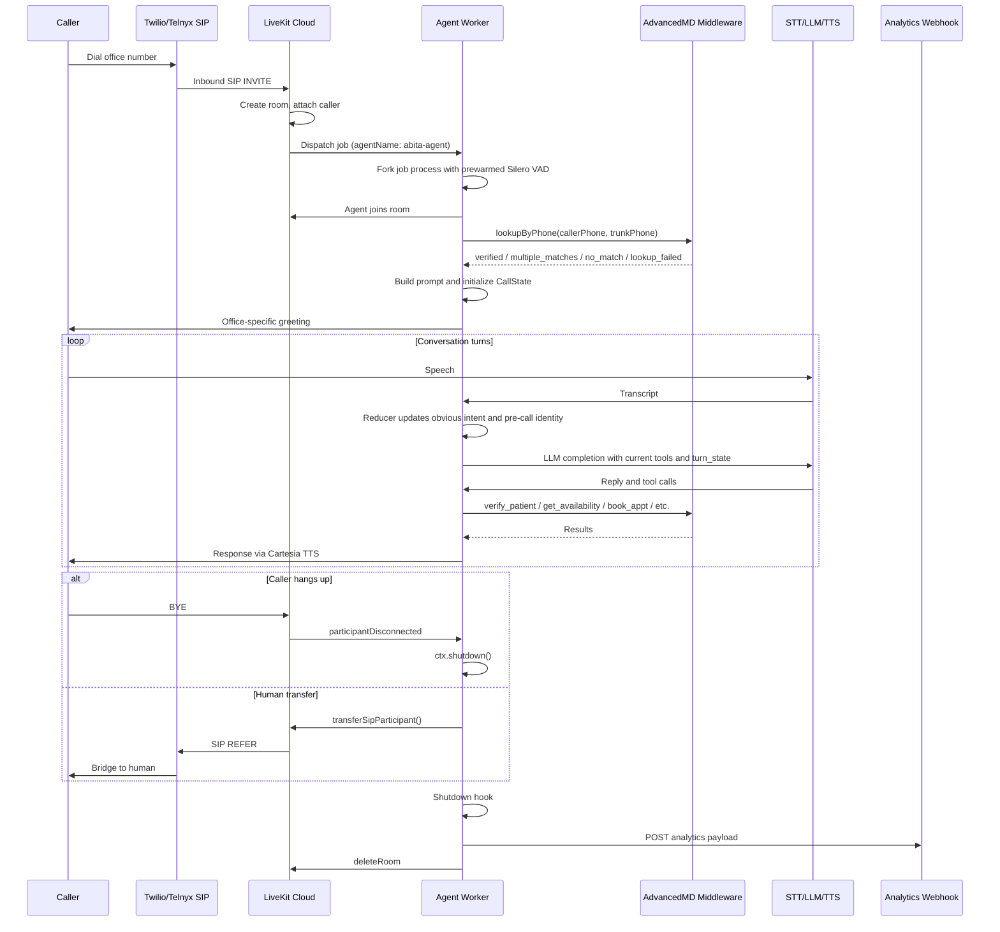

# LiveKit Voice Agent

A production phone agent for Abita Eye Group and Eye Radiance. Patients call
supported Twilio/Telnyx SIP trunks, LiveKit Cloud dispatches the `abita-agent`
worker, and the worker handles identity, scheduling, appointment changes,
insurance, practice FAQ, and human transfers against the AdvancedMD middleware.

The current architecture is harness-first: TypeScript owns workflow state,
tool safety, pre-call identity, dynamic tool exposure, and post-call analytics.
Prompt files still shape the agent's voice, but code decides what state is
trusted and which side effects are allowed.

## Stack

| Layer         | Provider                      | Current repo behavior                                                                                                                                                       |
| ------------- | ----------------------------- | --------------------------------------------------------------------------------------------------------------------------------------------------------------------------- |
| Telephony     | Twilio + Telnyx               | Inbound SIP trunks terminate into LiveKit Cloud SIP.                                                                                                                        |
| Runtime       | `@livekit/agents` on Node 22  | `src/main.ts` defines the worker, session, prewarm, shutdown hooks, and LiveKit CLI entrypoint.                                                                             |
| STT           | AssemblyAI direct plugin      | `u3-rt-pro`, language detection enabled, adaptive profiles from `src/stt-config.ts`, uses `ASSEMBLYAI_API_KEY`.                                                             |
| LLM           | Baseten                       | `llm.FallbackAdapter` with primary `zai-org/GLM-4.7` and fallback `MiniMaxAI/MiniMax-M2.5`.                                                                                 |
| TTS           | Cartesia direct plugin        | `sonic-3.5`, 16 kHz PCM, English voice override via `CARTESIA_TTS_VOICE`, Spanish voice from `src/tts-config.ts`.                                                           |
| VAD and turns | Silero + LiveKit Agents       | Silero VAD is prewarmed; turn handling uses STT turn detection, adaptive interruptions, and preemptive generation disabled.                                                 |
| Backend       | AdvancedMD Railway middleware | Phone lookup, patient verification/registration, insurance updates, availability, booking, and cancellation.                                                                |
| Observability | Analytics webhook             | Usage, LLM metrics, STT profile changes, tool executions, session events, turn metrics, flow state, pre-call lookup, language telemetry, and optional small audio payloads. |

## Call Flow



## Repo Layout

```text
src/
├── main.ts             # LiveKit worker, session setup, pre-call bootstrap, analytics shutdown
├── agent.ts            # Agent class, greeting, turn-state injection, dynamic tool refresh
├── prompt.ts           # Prompt assembly from workspace files plus dynamic caller context
├── tools.ts            # Model-facing tools and flow-policy integration
├── flow/               # Reusable reducer, planner, guards, events, state, and workflow plans
├── tooling/            # AdvancedMD client, pre-call bootstrap, handoff, knowledge, call state
├── customer/           # Active customer profile re-export
├── customers/abita/    # Abita office registry, greetings, trunk routing, features, handoff targets
├── model-config.ts     # Baseten primary/fallback model options
├── stt-config.ts       # AssemblyAI startup options and dynamic STT profiles
├── tts-config.ts       # Cartesia model, voices, language options
├── language-runtime.ts # English/Spanish voice-language switching and telemetry
└── __tests__/          # Vitest coverage for flow, tools, routing, session behavior, observability

workspace/
├── SOUL.md             # Identity/persona prompt section
├── VOICE.md            # Spoken style prompt section
├── FLOW_HARNESS_RUNBOOK.md
├── KNOWLEDGE_*.md      # Office FAQ content used by lookup_knowledge
└── INSURANCE_*.json    # Deterministic office insurance routing tables

docs/                   # Architecture, operations, and historical notes
scripts/                # Historical flow replay harness
livekit.toml            # LiveKit Cloud project and agent config
Dockerfile              # Node 22 build, livekit-agents download-files, production runner
```

## Runtime Behavior

1. **Inbound dispatch**: LiveKit Cloud creates a room and dispatches
   `abita-agent`. The worker prewarms Silero VAD and starts `entry()` from
   `src/main.ts`.
2. **Pre-call bootstrap**: `loadPreCallBootstrap(callerPhone, trunkPhone)`
   resolves the office from `src/customers/abita/profile.ts`, runs the
   AdvancedMD phone lookup, and records telemetry.
3. **Lookup outcomes**:
   - `verified`: one patient is found. The agent still asks a first-name
     challenge before using private facts, then uses loaded patient and
     appointment state without calling `verify_patient`.
   - `multiple_matches`: several patients share the caller phone. The reducer
     narrows by first name without reading names aloud.
   - `no_match`: the number is not on file. The agent asks whether the caller
     is existing or needs a new chart.
   - `lookup_failed`: middleware/auth/network lookup failed. The agent must not
     treat the caller as new just because pre-call lookup failed.
4. **Session state**: `session.userData` is a typed `CallState` containing the
   flow reducer state, office routing, patient facts, loaded appointments,
   availability cache, cancel tokens, transfer flags, telemetry, and language
   state.
5. **Prompt assembly**: `buildPrompt()` loads `SOUL.md`, `VOICE.md`, a compact
   generated harness contract, `FLOW_HARNESS_RUNBOOK.md`, dynamic caller
   context, and the state-memory contract.
6. **Turn loop**: after each completed user turn, `Agent.onUserTurnCompleted`
   records deterministic pre-call identity and obvious intent, injects compact
   `<turn_state>` and `<context_capsules>` guidance, and refreshes the current
   agent's tool context.
7. **Shutdown**: disconnect or transfer triggers `ctx.shutdown()`. The shutdown
   hook captures session report/audio when available, posts analytics with
   retry, and deletes the LiveKit room.

## Flow Harness

The flow harness is active for every supported Abita trunk. Supported trunks are
defined by the active customer profile, not by an environment flag.

The harness owns:

- current task, active intent, patient status, selected patient, visit type,
  routing, insurance coverage type, appointment facts, and pending actions
- pre-call single-match and multiple-match identity promotion
- duplicate availability-search blocking and cached-slot handling
- side-effect confirmation for registration, insurance updates, cancellation,
  booking, office routing, and transfer
- dynamic tool refresh after startup, user-turn state updates, and tool
  execution

There is no model-facing turn-understanding tool in the active tool registry.
Broad workflow tools may stay visible, but wrapper guards in `src/flow/*` and
`src/tools.ts` are the concrete safety boundary.

## Model-Facing Tools

The active model-callable tool surface is intentionally small:

| Tool                   | Purpose                                                                                      |
| ---------------------- | -------------------------------------------------------------------------------------------- |
| `verify_patient`       | Resolve an existing patient from caller phone plus first name, or full identity when needed. |
| `add_patient`          | Create a new patient after no-match or caller-confirmed registration.                        |
| `update_insurance`     | Update insurance for a verified patient after `check_insurance`.                             |
| `get_availability`     | Search appointment slots from current patient/routing/visit state.                           |
| `book_appt`            | Book a caller-confirmed slot using stored booking token and booking-note metadata.           |
| `cancel_appt`          | Cancel a loaded appointment using stored cancellation token.                                 |
| `check_insurance`      | Match medical or routine-vision insurance against office routing tables.                     |
| `lookup_knowledge`     | Retrieve office facts from the active location knowledge file before answering FAQ.          |
| `route_to_spring_hill` | Crystal River-only workflow switch to schedule through Spring Hill without transferring.     |
| `transfer_call`        | Transfer the SIP participant to the human office target.                                     |

Tool exposure starts with the broad office-appropriate set. After a confirmed
pre-call single match or multiple-match selection, dynamic exposure hides
`verify_patient` for that caller. `route_to_spring_hill` is exposed only for
offices whose profile enables that feature.

Every current tool calls `makeCurrentSpeechUninterruptible()` before it starts
work. Mutation tools treat an interrupted boundary as a stop condition and ask
for reconfirmation instead of submitting the side effect. Protected mutation
paths are `add_patient`, `update_insurance`, `cancel_appt`, `book_appt`,
`route_to_spring_hill`, and `transfer_call`; transfer also has duplicate
in-flight and already-attempted guards.

## Offices And Customer Profile

The active customer profile is `src/customer/profile.ts`, which currently
re-exports `src/customers/abita/profile.ts`.

That profile is the source of truth for:

- office keys: Spring Hill, Crystal River, Hollywood, Sweetwater, and dev
- trunk phone mapping
- greetings
- office knowledge and insurance files
- AdvancedMD office phone routing
- human handoff targets and optional handoff target environment overrides
- Crystal River to Spring Hill scheduling behavior

To port the architecture, add a new `src/customers/<customer>/profile.ts`,
point `src/customer/profile.ts` at it, and provide matching workspace knowledge,
insurance, greeting, routing, and handoff configuration.

## Local Development

Use Node 22 and pnpm 10.

```bash
pnpm install
cp .env.example .env.local
pnpm dev
```

`pnpm dev` runs `tsx src/main.ts dev`. Real inbound-call testing requires a
LiveKit Cloud project and a configured SIP trunk; see
[`docs/ops/telnyx-setup.md`](./docs/ops/telnyx-setup.md).

Useful checks:

```bash
pnpm format:check
pnpm lint
pnpm typecheck
pnpm test
```

Historical flow replay:

```bash
DATABASE_URL=postgres://... pnpm test:historical-flow -- --limit 100 --exclude-harness --report /private/tmp/abita-flow-replay.json
```

Or replay from an existing JSONL export:

```bash
pnpm test:historical-flow -- --input /path/to/calls.jsonl --report /private/tmp/abita-flow-replay.json
```

## Deployment

Pushes to `main` run CI and deploy through GitHub Actions. The deploy workflow
typechecks the repo, installs the LiveKit CLI, and runs:

```bash
lk agent deploy --yes
```

Useful status commands:

```bash
lk agent status
gh run list --workflow="Deploy to LiveKit Cloud" --limit 5
```

The Docker image builds TypeScript, runs `npx livekit-agents download-files`,
copies the model cache into the runtime image, prunes dev dependencies, and
starts with `pnpm start`.

## Environment Variables

| Variable                                                 | Purpose                                                                                 |
| -------------------------------------------------------- | --------------------------------------------------------------------------------------- |
| `LIVEKIT_URL` / `LIVEKIT_API_KEY` / `LIVEKIT_API_SECRET` | LiveKit Cloud credentials for the worker, room deletion, and SIP transfer.              |
| `BASETEN_API_KEY`                                        | Baseten LLM access for primary and fallback models.                                     |
| `ASSEMBLYAI_API_KEY`                                     | AssemblyAI direct STT plugin.                                                           |
| `CARTESIA_API_KEY`                                       | Cartesia direct TTS plugin.                                                             |
| `CARTESIA_TTS_VOICE`                                     | Optional English Cartesia voice override.                                               |
| `AMD_API_URL`                                            | Optional AdvancedMD middleware base URL; defaults to the production Railway middleware. |
| `AMD_API_TOKEN`                                          | Authorization header sent to the AdvancedMD middleware.                                 |
| `SPRING_HILL_HANDOFF_TARGET`                             | Optional Spring Hill human-transfer target, `tel:+E164` or `sip:user@domain`.           |
| `TELNYX_VOICE_API_HANDOFF_TARGET`                        | Legacy/alternate Spring Hill handoff target override.                                   |
| `HOLLYWOOD_HANDOFF_TARGET`                               | Optional Hollywood human-transfer target override.                                      |
| `SWEETWATER_HANDOFF_TARGET`                              | Optional Sweetwater human-transfer target override.                                     |
| `ANALYTICS_URL`                                          | Optional post-call analytics webhook URL.                                               |
| `WEBHOOK_SECRET`                                         | Optional bearer token for analytics POSTs.                                              |
| `PROMPT_WORKSPACE`                                       | Optional prompt workspace path, default `workspace`.                                    |
| `DATABASE_URL`                                           | Optional Postgres URL for `pnpm test:historical-flow` when not using `--input`.         |

## Secrets Management

Be careful with LiveKit Cloud agent secrets. `lk agent update-secrets` replaces
the agent secret set unless you include the full desired set. Before changing a
single secret, fetch the current values with `lk agent secrets`, edit locally,
and push the complete set back intentionally.

## Known History

- **2026-04-09**: `@livekit/agents@1.2.3` had a ProcPool concurrency bug that
  delayed or missed overlapping inbound calls. The repo was bumped after the
  upstream fix. See
  [`docs/history/incident-2026-04-09-concurrent-dispatch.md`](./docs/history/incident-2026-04-09-concurrent-dispatch.md).

## Further Reading

- [`docs/README.md`](./docs/README.md) - architecture and operations document map
- [`docs/architecture/flow-controller-current-contract.md`](./docs/architecture/flow-controller-current-contract.md) - current flow harness contract
- [`docs/architecture/legacy-cleanup-and-next-steps.md`](./docs/architecture/legacy-cleanup-and-next-steps.md) - cleanup record and remaining migration notes
- [`docs/ops/assemblyai.md`](./docs/ops/assemblyai.md) - AssemblyAI STT design notes
- [`docs/ops/telnyx-setup.md`](./docs/ops/telnyx-setup.md) - SIP trunk provisioning and call testing
