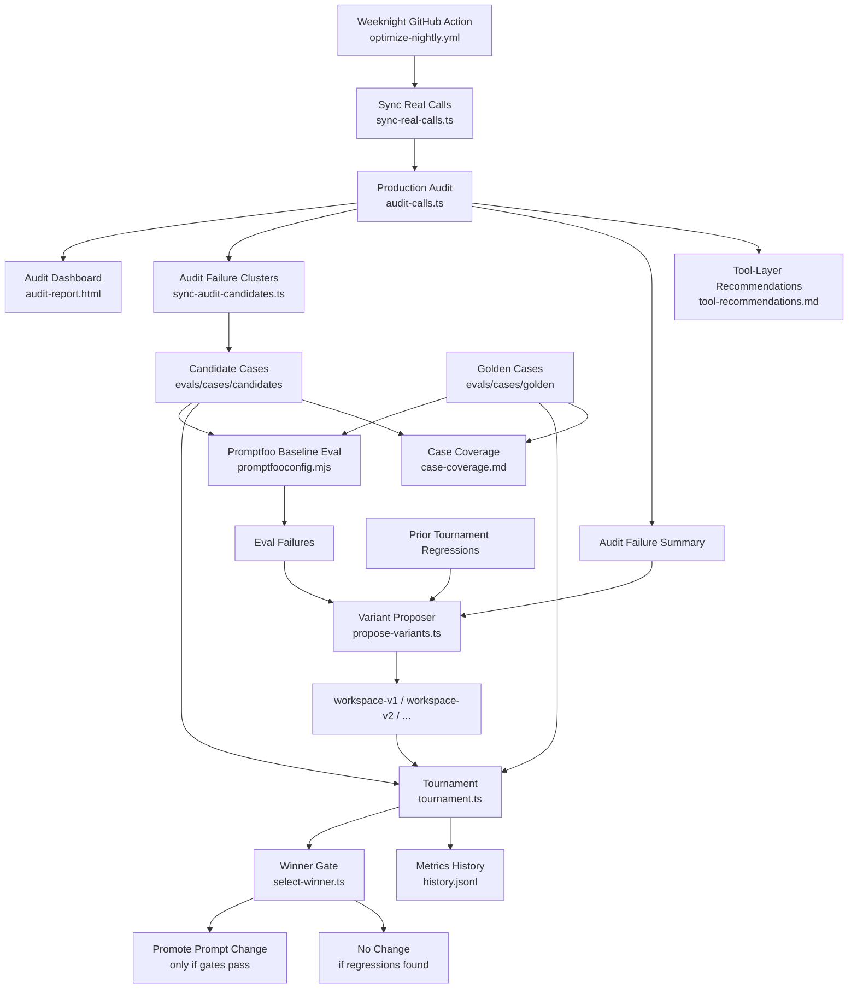

# Eval System Architecture

This is the operational map of the eval system: what runs, what each part
does, how it creates value, and where it does and does not match production.

## One-page view

## Core idea

The system has two layers:

1. `Production audit layer`
   - looks at real calls
   - explains what failed, why, and what worked

2. `Regression layer`
   - replays decision-point cases through the real agent stack
   - tests prompt changes before anything gets promoted

That split matters.

- The audit layer gives you diagnosis.
- The regression layer gives you safety.

Without the audit layer, you optimize against synthetic abstractions.
Without the regression layer, you optimize against anecdotes.

## What each step does

### 1. Sync real calls

Script: `evals/scripts/sync-real-calls.ts`

Purpose:
- pull recent `CallEvent` rows from production
- extract decision-point candidate cases from real behavior

Value:
- keeps the eval suite anchored to live traffic
- surfaces real edge cases the seed goldens never covered

### 2. Audit real calls

Script: `evals/scripts/audit-calls.ts`

Outputs:
- `audits-YYYY-MM-DD.json`
- bucketed quality metrics

Per call, the audit records:
- intent bucket
- resolved / unresolved
- tool correctness
- path efficiency
- hallucination / safety
- strengths
- recommended fixes

Value:
- tells you why a call failed, not just that it failed
- gives you operational visibility by business bucket

### 3. Cluster audit failures into candidate evals

Script: `evals/scripts/sync-audit-candidates.ts`

Purpose:
- take repeated audit failures
- convert representative examples into candidate eval cases

Value:
- the system learns from production instead of staying static
- recurring failures become replayable tests

### 4. Run promptfoo baseline

Config:
- `evals/promptfoo/promptfooconfig.mjs`
- `evals/promptfoo/livekit-agent-provider.mjs`

Replay entrypoint:
- `evals/lib/run-decision-point-case.ts`

Purpose:
- replay golden and candidate cases against the current workspace prompt

Value:
- establishes the current baseline before any prompt change is proposed
- keeps a trust boundary between curated/audit-driven strict cases and noisier
  runbook-only candidate coverage

### 5. Propose variants

Script: `evals/scripts/propose-variants.ts`

Current behavior:
- reads fresh eval failures
- reads audit failure clusters
- reads prior tournament regressions
- proposes narrow variants with:
  - `focus`
  - `scope` = `prompt-layer` or `tool-layer`

Value:
- changes are targeted, not broad runbook rewrites
- prior regressions become protected behavior

### 6. Tournament

Script: `evals/scripts/tournament.ts`

Purpose:
- run the same suite on:
  - baseline workspace
  - each proposed variant

Value:
- turns prompt ideas into measured comparisons

### 7. Winner gate

Script: `evals/scripts/select-winner.ts`

A variant only wins if it clears all gates:
- golden does not regress
- golden suite regressions stay below threshold
- candidate overall does not regress materially
- candidate suites do not regress materially

Value:
- blocks attractive-but-worse prompt edits

### 8. Reports and operating artifacts

Artifacts:
- `audit-report.html`
- `tool-recommendations.md`
- `case-coverage.md`
- `history.jsonl`

Value:
- dashboard for daily review
- explicit separation of prompt fixes vs tool/code fixes
- visibility into suite composition and gaps

## Why this is valuable

This system provides four concrete forms of value:

### 1. Real production diagnosis

It audits actual calls and tells you:
- which bucket is failing
- whether the call resolved
- whether the tool path was correct
- whether the agent hallucinated
- what the agent did well

### 2. Coverage that grows from reality

Repeated real failures become candidate cases.
Strong candidates can be promoted into goldens.

That means the suite can get smarter over time instead of staying frozen.

### 3. Safe prompt iteration

The system proposes prompt changes, but it does not trust them.
Every variant has to survive replay and gating.

### 4. Separation of prompt problems from tool problems

Not every failure should cause prompt churn.

Tool-layer recommendations now explicitly surface failures that should be fixed
in:
- tool wrappers
- tool schemas
- helper logic
- state transitions
- grounding contracts

instead of trying to patch everything with prompt text.

## Is this production 1:1?

No. Not fully.

It is best described as:

- `real production audit` for what actually happened
- `high-fidelity decision-point replay` for what the agent would do in a given moment

It is not a complete production twin.

## Fidelity map

### What is close to production

- same prompt assembly from `src/prompt.ts`
- same workspace files:
  - `workspace/SOUL.md`
  - `workspace/VOICE.md`
  - `workspace/RUNBOOK.md`
- same agent session machinery
- same default replay LLM stack from `src/__tests__/helpers.ts`
- same tool-selection logic path inside replayed decisions
- real production `CallEvent` data for the audit layer

### What is not 1:1

- promptfoo replay uses mocked tools, not live production side effects
- decision-point cases replay reconstructed state, not the full original runtime
- some tool results are flattened into conversation context
- full call orchestration is not replayed end to end for every case
- the audit judge is an external scorer looking at the finished call after the fact

## Practical fidelity rating

Use this framing:

- `Production audit`: 9/10 for “what actually happened”
- `Decision-point replay`: 7-8/10 for “what the agent would do here”
- `Full production twin`: not implemented

That is a good tradeoff for an eval system. Full production twins are much more
expensive and operationally brittle.

## What would make it more 1:1 later

If you want to push fidelity up, the next upgrades are:

1. replay more full-call state instead of only decision-point context
2. preserve tool result objects more faithfully in candidate cases
3. add a small “critical flows” suite with near end-to-end replay for:
   - confirm
   - registration
   - reschedule
   - routing / transfer

## How to use it operationally

Each weekday run should answer:

1. What failed in real calls?
2. Why did it fail?
3. Is it a prompt problem or a tool problem?
4. Did a proposed prompt fix actually help?
5. Did it break something else?

If the answer to 4 is yes and 5 is no, promote.
If the answer to 3 is tool problem, route it to code/tool work instead of
rewriting the runbook.

## Current limit

The loop can now identify `tool-layer` failures and recommend them explicitly,
but it does not yet auto-edit tool definitions.

That is intentional. Prompt edits can be safely tournamented automatically.
Tool/code edits should still go through normal engineering review.
