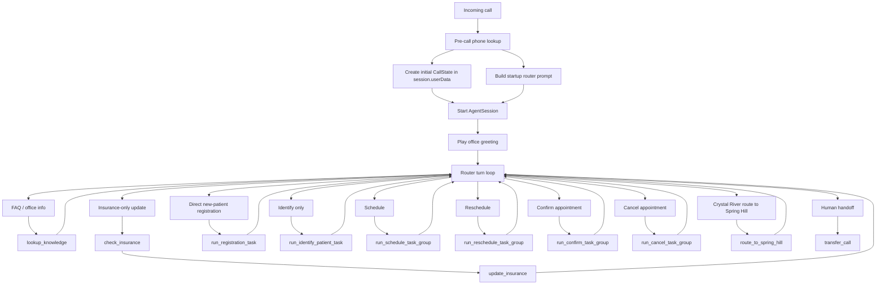
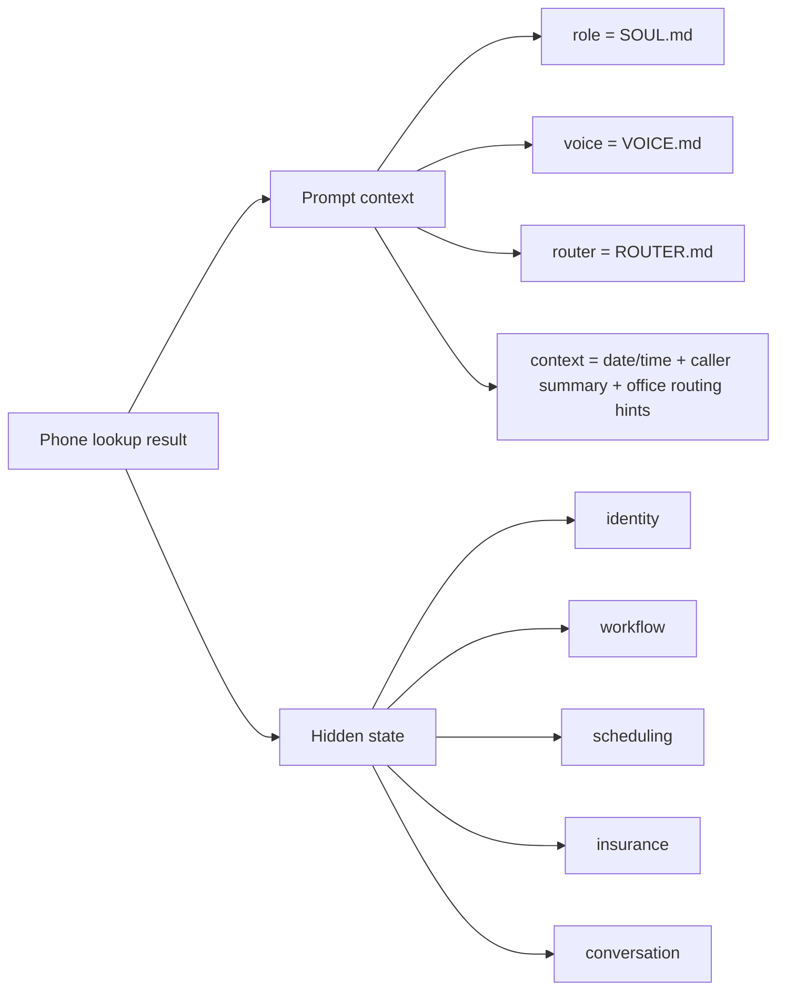
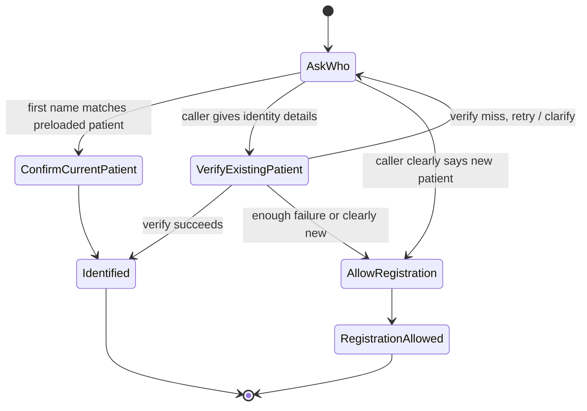
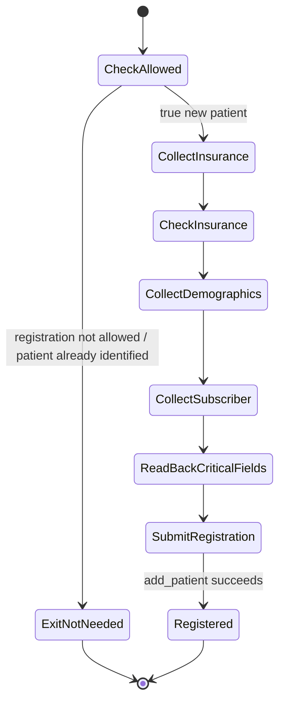
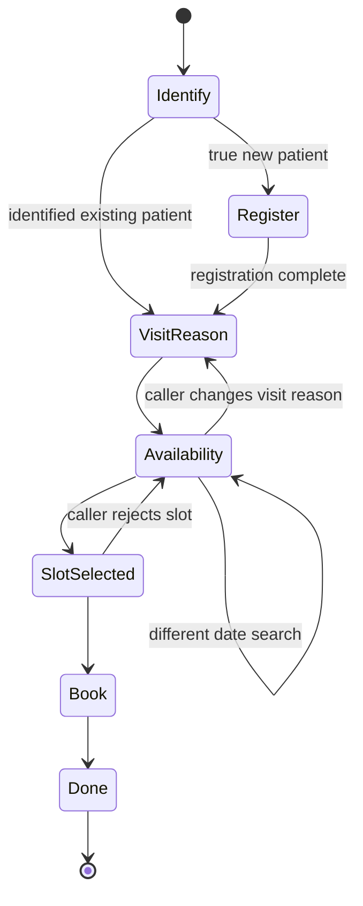
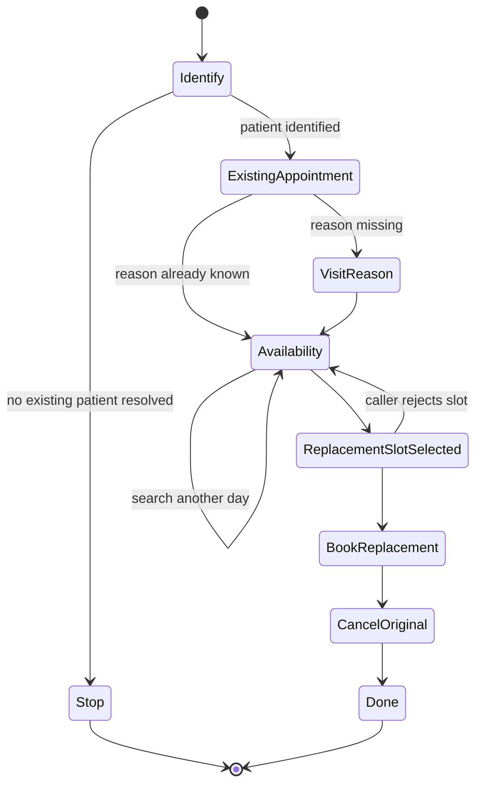
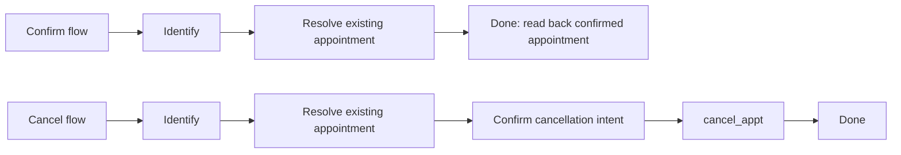
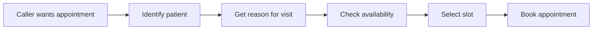
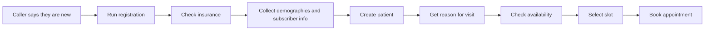

# Agent State Machine

This document shows the startup path, router decisions, workflow task groups, and the hidden `CallState` model that drives the agent.

## Whole Agent

## Startup Context

## Identify Task

## Registration Task

## Schedule Flow

## Reschedule Flow

## Confirm And Cancel Flows

## Call State Model

```mermaid
flowchart TD
    S[CallState]
    S --> I[identity]
    S --> W[workflow]
    S --> SCH[scheduling]
    S --> INS[insurance]
    S --> C[conversation]

    I --> I1[patientId / patientName / dob]
    I --> I2[lookupMatchStatus]
    I --> I3[callerConfirmedPatient]
    I --> I4[activePatientSource]
    I --> I5[switchedPatientThisCall]

    W --> W1[intent]
    W --> W2[activeFlow]
    W --> W3[appointmentIntent]
    W --> W4[verificationStatus]
    W --> W5[verificationAttempts]
    W --> W6[registrationAllowed]
    W --> W7[registrationComplete]

    SCH --> S1[reasonForVisit]
    SCH --> S2[lastAvailabilityQuery]
    SCH --> S3[lastAvailabilityRaw]
    SCH --> S4[selectedSlot]
    SCH --> S5[targetAppointmentId]
    SCH --> S6[appointments]

    INS --> N1[checkedInsurancePlan]
    INS --> N2[routing]
    INS --> N3[allowedProviders]
    INS --> N4[routingAmbiguous]
    INS --> N5[preauthRequired]

    C --> C1[transferred]
    C --> C2[lastToolCallFingerprint]
```

## Happy Path Summary

### Existing patient schedule

### True new patient schedule

